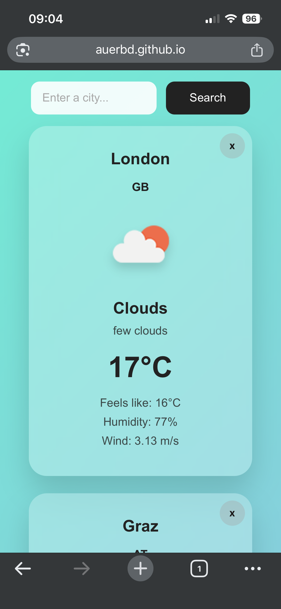
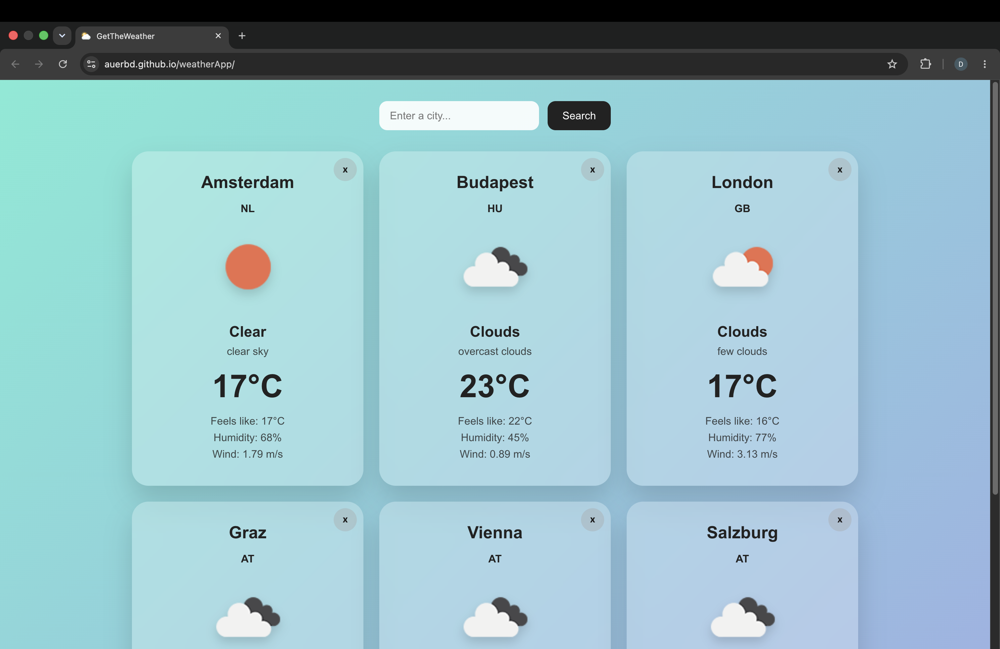

# Weather App

A React weather application using OpenWeather API.

\
Try it on: [Github Pages](https://auerbd.github.io/weatherApp/)

## Features
- Search cities
- Current weather data
- Temperature, humidity, wind
- Responsive UI

## Technologies
- React
- Vite
- CSS
- OpenWeather API

## Setup

Create a `.env` file:

VITE_OPENWEATHER_API_KEY=your_key_here

## Run

- npm install
- npm run dev